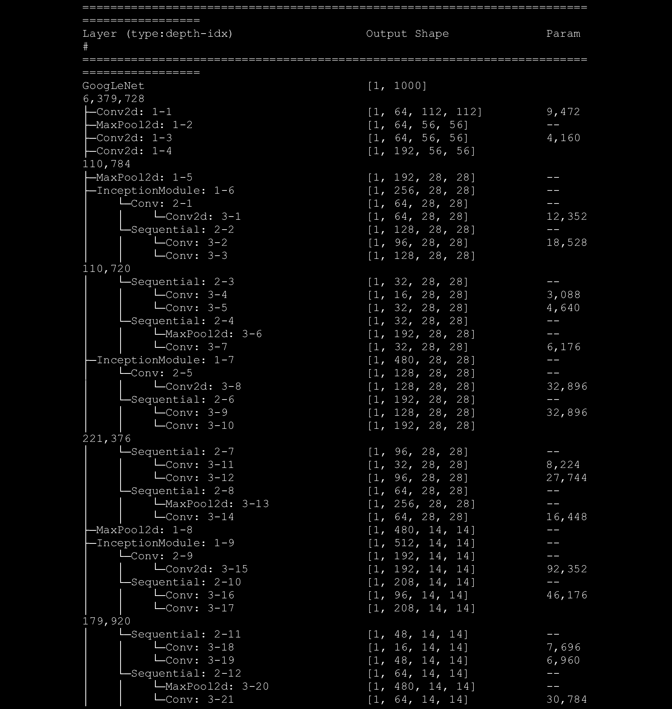
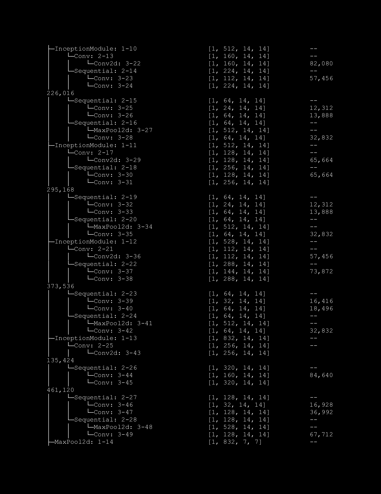
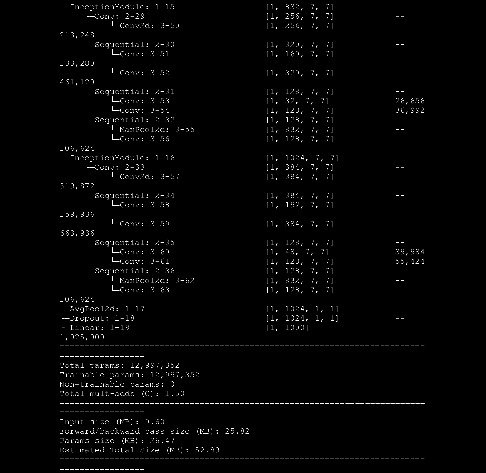

# GoogLeNet-Inception-V1-Implementation

## Architecture


"Going Deeper with Convolutions" by Christian Szegedy, Wei Liu, Yangqing Jia, Pierre Sermanet, Scott Reed, Dragomir Anguelov, Dumitru Erhan, Vincent Vanhoucke and Andrew Rabinovich.

Paper: https://arxiv.org/pdf/1409.4842.pdf

## Inception Module


## Another day, same old story

GPU POOR !!!

Didn't train cause I don't have a powerful GPU. But the architecture is there for playing.

## Info

Run script below to checkout the model informations

```sh
python info.py
```





## Usage

Before running the script, place your data directory location for both train and test data in `root_dir="{DIR}"` here at [dataloader.py](./dataloader/dataloader.py)

```sh
python train.py --epochs 100
```