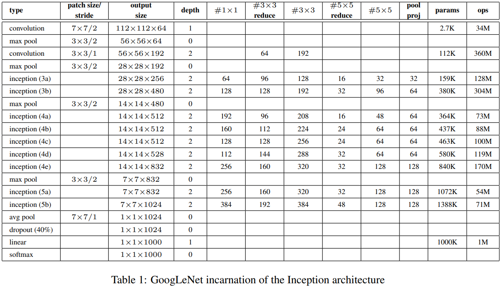
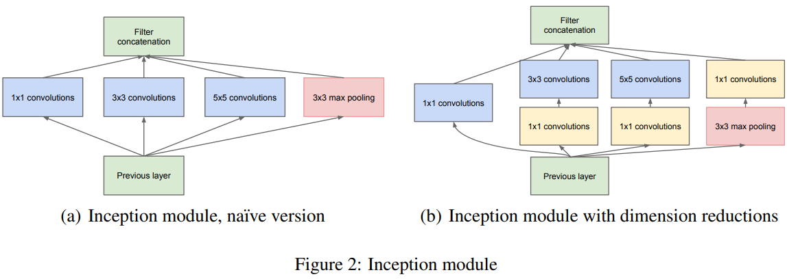
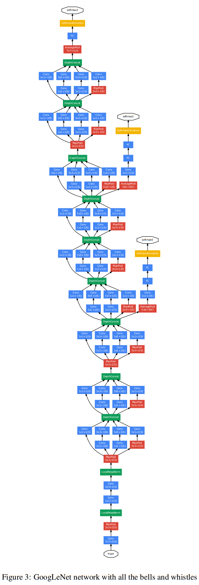

# GoogLeNet-Inception-V1-V2-Implementation

## GoogLeNet (Inception-V1)

"Going Deeper with Convolutions" by Christian Szegedy, Wei Liu, Yangqing Jia, Pierre Sermanet, Scott Reed, Dragomir Anguelov, Dumitru Erhan, Vincent Vanhoucke and Andrew Rabinovich.

Paper: https://arxiv.org/pdf/1409.4842.pdf

## Inception-V2

Simply, it introduces the use of Batch Normalization inside the Inception InceptionModule. Check out here for more: https://paperswithcode.com/method/inception-v2.

## Architecture



## Inception Module





## Another day, same old story

GPU POOR !!!

Didn't train cause I don't have a powerful GPU. But the architecture is there for playing.

## Info

Run script below to checkout the model informations

```sh
python info.py
```

## Usage

Before running the script, place your data directory location for both train and test data in `root_dir="{DIR}"` here at [dataloader.py](./dataloader/dataloader.py)

```sh
python train.py --epochs 100 --version 1
```

## Citation

```
@misc{szegedy2014goingdeeperconvolutions,
      title={Going Deeper with Convolutions}, 
      author={Christian Szegedy and Wei Liu and Yangqing Jia and Pierre Sermanet and Scott Reed and Dragomir Anguelov and Dumitru Erhan and Vincent Vanhoucke and Andrew Rabinovich},
      year={2014},
      eprint={1409.4842},
      archivePrefix={arXiv},
      primaryClass={cs.CV},
      url={https://arxiv.org/abs/1409.4842}, 
}
```
